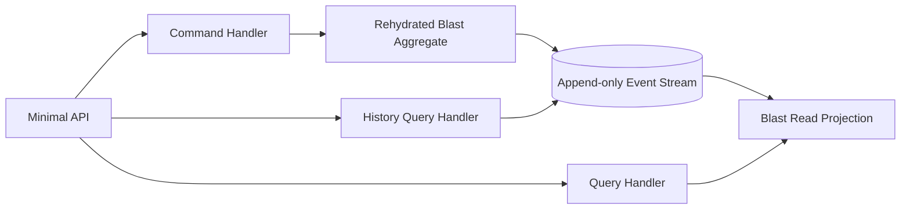

# Blast Management API — CQRS and Event Sourcing

A .NET 8 implementation of the supplied senior developer exercise.

## Included

- Append-only in-memory event store.
- One ordered event stream per blast.
- Optimistic concurrency using an expected stream version.
- Event-sourced `Blast` aggregate and event-sourced `Hole` child entities.
- Separate command objects and command handlers.
- Separate query objects and query handlers.
- Minimal API endpoints with meaningful `400`, `404`, and `409` responses.
- Typed event history.
- In-memory read-model projection subscribed to appended events.
- Optional `MarkHoleReady` / strict-ready bonus rule.
- Unit tests for domain rules, replay, projection flow, and concurrency.

No MediatR, CQRS framework, aggregate framework, or database is used.

## Design decision: one stream per blast

A hole is modelled as an event-sourced child entity inside the `Blast` aggregate boundary. Hole events (`HoleAdded`, `HoleCharged`, and `HoleMarkedReady`) are stored in the blast stream.

This is intentional: firing a blast requires checking every hole. Keeping those events in one stream lets `FireBlast` validate the invariant and append `BlastFired` atomically with optimistic concurrency. Separate hole streams would require cross-stream consistency or a saga/process manager.



## Event-store versioning

- An absent or empty stream has version `0`.
- The first stored event has stream version `1`.
- A command rehydrates the aggregate, whose `Version` is the number of replayed events.
- Saving calls `AppendAsync(streamId, expectedVersion, newEvents)`.
- If the current stream version differs from `expectedVersion`, the store throws `OptimisticConcurrencyException`; the API maps it to HTTP `409 Conflict`.

Events are immutable records. Aggregate state is changed only by applying events. There are no update operations and aggregate state is never stored directly.

## CQRS read side

`GetBlastQuery` reads a pre-built `BlastReadModelProjection`. The event store publishes newly appended events to this projection synchronously, which gives immediate consistency and inexpensive reads in this single-process exercise.

In a production system, the projection would usually be asynchronous and durable. That improves write isolation and scalability, but introduces eventual consistency and requires checkpoints, idempotency, retries, and replay/rebuild support. The event stream remains the source of truth.

`GetBlastHistoryQuery` reads the ordered stream directly and returns entries containing:

- `streamVersion`
- `eventType`
- `occurredAt`
- the concrete event payload

## Domain lifecycle

### Blast

`Planned -> Loaded -> Blasted`

`Loaded` is derived when at least one hole exists and every hole is `Charged` or `Ready`. `Blasted` is derived from `BlastFired`.

### Hole

`Planned -> Charged -> Ready`

Core firing behaviour accepts holes in `Charged` or `Ready`, matching the main exercise. The bonus strict rule can require every hole to be `Ready`.

Additional safeguards keep the lifecycle coherent:

- A blast must contain at least one hole before firing.
- Holes can only be added while the blast is `Planned`.
- A fired blast cannot be modified or fired again.
- Charging an already `Charged` or `Ready` hole is rejected.
- A hole can become `Ready` only from `Charged`.
- Direction must be between `0` and `360`; coordinates and numeric values must be finite.

## HTTP endpoints

| Method | Route | Operation |
|---|---|---|
| `POST` | `/blasts` | Create a blast |
| `POST` | `/blasts/{blastId}/holes` | Add a hole |
| `PUT` | `/blasts/{blastId}/holes/{holeId}/charge` | Charge a hole |
| `PUT` | `/blasts/{blastId}/holes/{holeId}/ready` | Mark a hole ready — bonus |
| `POST` | `/blasts/{blastId}/fire` | Fire a blast |
| `GET` | `/blasts/{blastId}` | Read the projected blast state |
| `GET` | `/blasts/{blastId}/history` | Read the ordered typed event log |

## Run

```bash
dotnet restore
dotnet run --project src/BlastManagement.Api
```

The development profile listens on `http://localhost:5080`.

The file `src/BlastManagement.Api/BlastManagement.Api.http` contains requests that can be run from Visual Studio, Rider, or VS Code REST Client.

## Example request bodies

Create a blast:

```json
{
  "name": "B-042"
}
```

Add a hole:

```json
{
  "name": "H-01",
  "position": {
    "x": 10.5,
    "y": 20.25,
    "z": -3.0
  },
  "direction": 180,
  "inclination": 15
}
```

## Enable the strict-ready bonus

The default configuration implements the core rule: all holes must be `Charged` or `Ready` before firing.

To require every hole to be `Ready`, edit `src/BlastManagement.Api/appsettings.json`:

```json
{
  "BlastRules": {
    "RequireReadyToFire": true
  }
}
```

Then call the `/ready` endpoint for every charged hole before firing.

## Tests

```bash
dotnet test
```

The tests cover event creation, lifecycle transitions, invalid commands, strict and core firing rules, event replay, stream versioning, optimistic concurrency, projection publication, and a complete command/query flow.

A GitHub Actions workflow in `.github/workflows/ci.yml` restores, builds, tests, and collects coverage after the repository is pushed.
